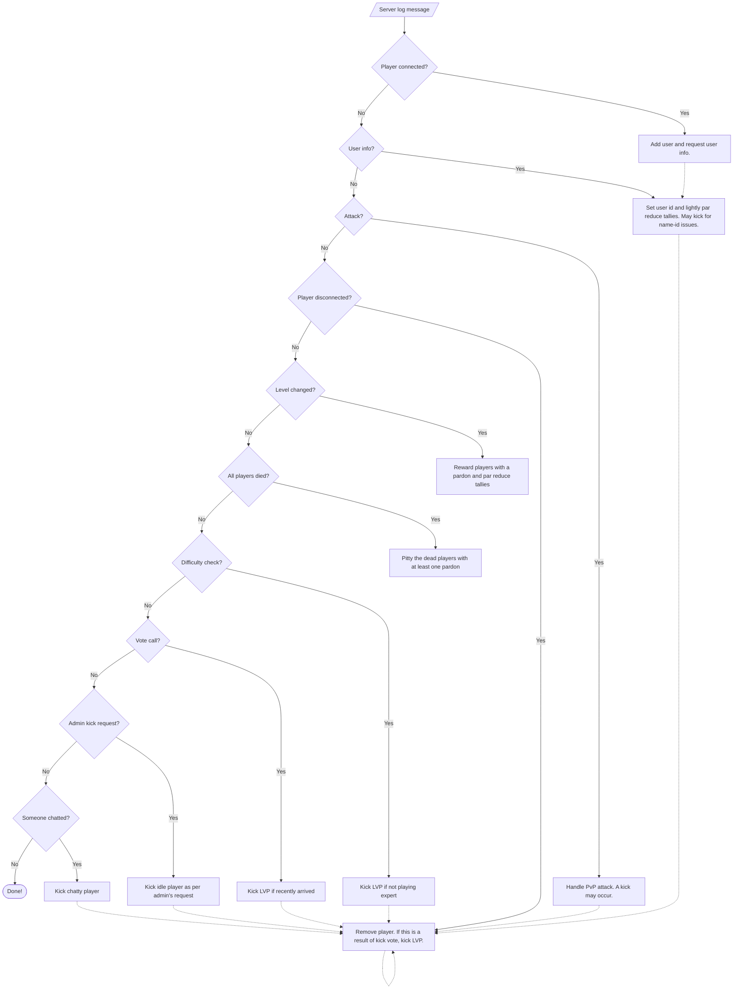

# L4d2Observer

* [VERSION 1.0.230525](https://github.com/carlosjhr64/l4d2-observer/releases)
* [github](https://www.github.com/carlosjhr64/l4d2-observer)

## DESCRIPTION

A L4D2 server observer that kicks players out for poor play.

## INSTALL

You'll need:

* Ruby 3.2 and the following gems:
  * help_parser
  * rainbow
* Runs on Linux
* Obviously a working L4D2 dedicated server:
  * See [Linode's guide](https://www.linode.com/docs/guides/left-4-dead-2-multiplayer-server-installation/)
```console
git clone git@github.com:carlosjhr64/l4d2-observer.git
cd l4d2-observer
./bin/compile > l4d2-observer
mv l4d2-observer /path-to/bin/l4d2-observer
# You may need to set it as an excutable
chmod u+x /path-to/bin/l4d2-observer
screen # preferably so that you can detach
# And just run it...
l4d2-observer --admin=yourPlayerName
```
Please read the code for all the goodies!

## HELP
```console
$ l4d2-observer --help
### L4D2 Friendly Fire Observer ###
Usage:
  l4d2-observer [:options+] [<srcds_dir>]
Options:
  --ff=N      	FF limit
  --exposure=N	Exposure limit
  --pardons=N 	Pardons limit
  --pity=N    	Pity limit
  --kicks=N   	Kicks limit
  --admin=W   	Admin's name
Types:
  N   /^\d$/
  W   /^\w+$/
# Notes:
#   srcds_dir defaults to ~/Steam/L4D2-server
#   N defaults to 3
#   admin defaults to "Caprichozo" (me :D)
```
## MOTD

The following is a suggested `motd.txt`:
```markdown
# Need to know

Server autokicks for:

* Chat
* Friendly Fire(FF)
* Exposure to FF
* Vote

Thanks for playing!

# Reconnect

If kicked, you may reconnect via console:

    connect [the.dedicated.server.ip]

# NOT A MOD

It's a VAC server and you will be awarded any achievement in the game.
See L4D2-Observer:

    https://github.com/carlosjhr64/l4d2-observer

# Rankings and tallies

Rankings and FF tallies are eventfully displayed as:

    FirstPLayer-FF-Exposure-Pardons ... LastPlayer-FF-Exposure-Pardons

Every FF will demote you down to last place at which point you'll be kicked.
You'll also be kicked for excessive FF(>3) and exposure(>3).

After having played at least 3 minutes, pardons are granted for:

* Pity after team death, 1 if player has none, up to 3 times
* Level completion, +1, up to 3 max

Tallies are re-balanced by a par minimum when a new player joins the game, and
by a par middle when a level is completed.

# Other kicks

* There is no tolerance for chat, not even with pardons
* After 3 kicks, a player(troll) will be kicked on any FF or exposure
* On a vote call, last player will be kicked unless played at least 3 minutes
* Unless in expert mode, last player gets kicked every 3 minutes
* A vote to kick will also kick the last player
* Name changes or weird names can cause a kick

The server is meant to be played for an entire uninterrupted campaign in expert
mode. The vote suppression is meant to stop server hijacking.

# Admin

If the game's admin leaves or is kicked,
the longest playing player is assigned as the new admin.
The job is to kick idle and name changing trolls.
The command must be entered exactly or
the admin will get kicked for chat!
To kick player number 1, 2, 3, or 4 respectively:

* `say !idle1`
* `say !idle2`
* `say !idle3`
* `say !idle4`

To check for name changers:

* `say !users`
```
## FLOWCHART

The following flowchart describes `Observer#process(line)` in
`l4d2-observer/observer.rb`:

## LICENSE

Copyright (c) 2023 CarlosJHR64

Permission is hereby granted, free of charge,
to any person obtaining a copy of this software and
associated documentation files (the "Software"),
to deal in the Software without restriction,
including without limitation the rights
to use, copy, modify, merge, publish, distribute, sublicense, and/or sell
copies of the Software, and
to permit persons to whom the Software is furnished to do so,
subject to the following conditions:

The above copyright notice and this permission notice
shall be included in all copies or substantial portions of the Software.

THE SOFTWARE IS PROVIDED "AS IS",
WITHOUT WARRANTY OF ANY KIND, EXPRESS OR IMPLIED,
INCLUDING BUT NOT LIMITED TO THE WARRANTIES OF MERCHANTABILITY,
FITNESS FOR A PARTICULAR PURPOSE AND NONINFRINGEMENT.
IN NO EVENT SHALL THE AUTHORS OR COPYRIGHT HOLDERS BE LIABLE FOR ANY CLAIM,
DAMAGES OR OTHER LIABILITY, WHETHER IN AN ACTION OF CONTRACT,
TORT OR OTHERWISE, ARISING FROM, OUT OF OR IN CONNECTION WITH
THE SOFTWARE OR THE USE OR OTHER DEALINGS IN THE SOFTWARE.
